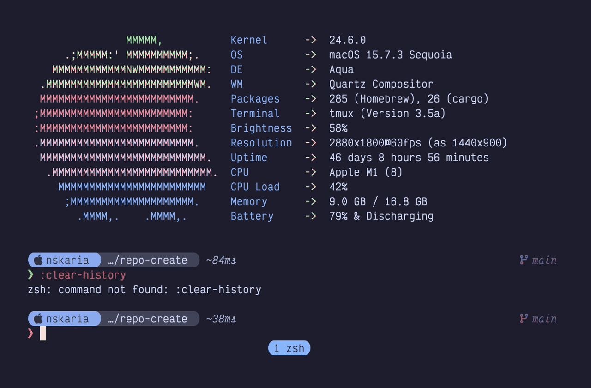
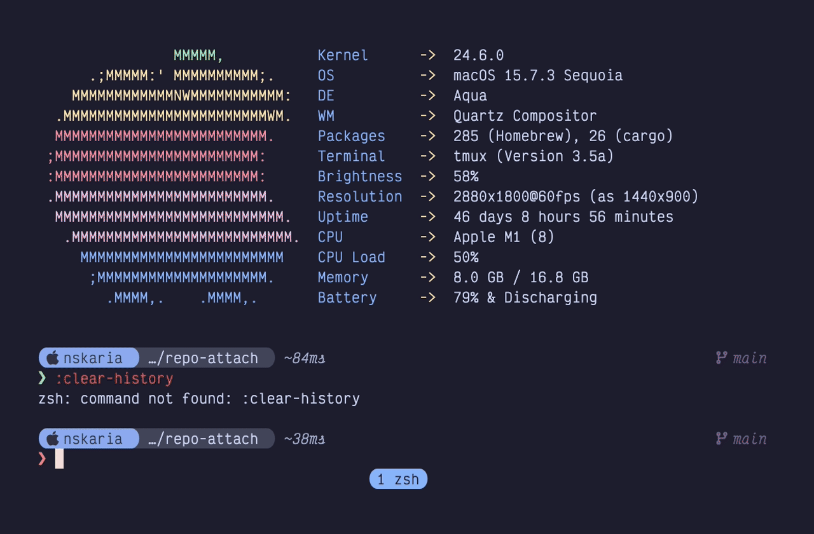
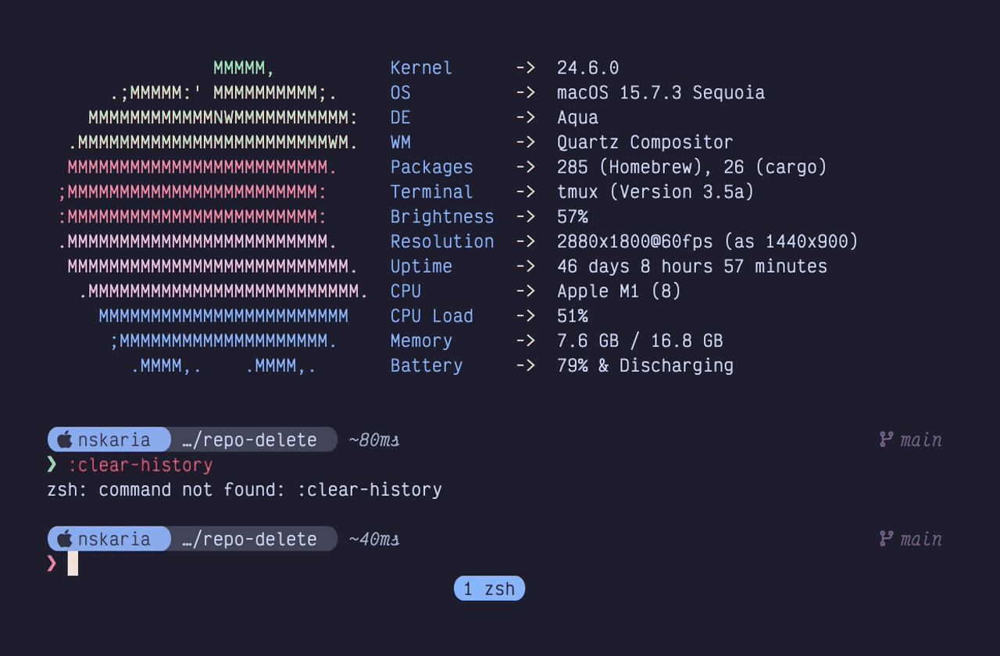

<div align="center">
<pre>
╔════════════════════════════════════════════════════════════════╗
║  ███████╗███████╗███████╗██╗  ██╗███╗   ███╗██╗   ██╗██╗  ██╗  ║
║  ██╔════╝██╔════╝██╔════╝██║  ██║████╗ ████║██║   ██║╚██╗██╔╝  ║
║  ███████╗█████╗  ███████╗███████║██╔████╔██║██║   ██║ ╚███╔╝   ║
║  ╚════██║██╔══╝  ╚════██║██╔══██║██║╚██╔╝██║██║   ██║ ██╔██╗   ║
║  ███████║███████╗███████║██║  ██║██║ ╚═╝ ██║╚██████╔╝██╔╝ ██╗  ║
║  ╚══════╝╚══════╝╚══════╝╚═╝  ╚═╝╚═╝     ╚═╝ ╚═════╝ ╚═╝  ╚═╝  ║
║             TUI for git worktrees + tmux sessions              ║
╚════════════════════════════════════════════════════════════════╝
</pre>
</div>

<p align="center"><code>seshmux</code> is a rust tui for managing git worktrees with dedicated tmux sessions</p>

## Demo

<table>
  <tr>
    <td align="center" width="50%">
      <a href="https://raw.githubusercontent.com/Skarian/seshmux/main/demo/output/01-create-and-attach.gif" target="_blank" rel="noopener noreferrer"></a><br>
      <sub>Create worktree + tmux session</sub>
    </td>
    <td align="center" width="50%">
      <a href="https://raw.githubusercontent.com/Skarian/seshmux/main/demo/output/02-attach-existing.gif" target="_blank" rel="noopener noreferrer"></a><br>
      <sub>Attach to existing tmux session</sub>
    </td>
  </tr>
  <tr>
    <td align="center" colspan="2">
      <a href="https://raw.githubusercontent.com/Skarian/seshmux/main/demo/output/03-delete-and-kill.gif" target="_blank" rel="noopener noreferrer"></a><br>
      <sub>Delete worktree + kill tmux session</sub>
    </td>
  </tr>
</table>

## Features

- Manage Git worktrees from one TUI
- Create a tmux session per worktree as needed
- Carry selected untracked/gitignored files into new worktrees
- Attach to or create worktree sessions from the TUI
- Define per-window programs via config
- Vim-style keybindings

## Requirements

- macOS
- `git` with `git worktree`
- `tmux`

## Install

```bash
cargo install --path crates/seshmux-cli --force
```

## Quick Start

Run from inside a git repository with at least one commit on the current branch/HEAD:

```bash
seshmux
```

If this is your first run, complete setup first.

## Setup

1. Run diagnostics:

```bash
seshmux doctor
```

2. Create config directory:

```bash
mkdir -p ~/.config/seshmux
```

3. Create `~/.config/seshmux/config.toml`.
   Use the format in the `Configuration` section below.

## Configuration

`~/.config/seshmux/config.toml` defines the tmux session layout that `seshmux` creates for worktrees.

How it works:

- `version` is the config schema version (`1`)
- `[[tmux.windows]]` defines tmux windows that `seshmux` creates for each worktree session
- Window entries are created in the same order they appear in the file
- Use window names and commands that match your normal workflow (editor, git UI, build/test, etc.)

Field reference:

- `name`: required display name for the tmux window
- `program`: executable for direct mode (example: `nvim`, `lazygit`, `pnpm`)
- `args`: optional argument list for direct mode (`["."]` means pass `.` as one argument)
- `shell`: shell invocation array for shell mode (example: `["/bin/zsh", "-lc"]`)
- `command`: command string run by the shell in shell mode

Direct vs shell mode:

- Direct mode runs a program directly with explicit args. Use this for most windows.
- Shell mode starts a shell, then the shell interprets `command`. Use this when commands depend on shell `PATH`/environment, or when you need shell behavior like chaining commands (`&&`), pipes (`|`), redirects (`>`), or shell expansion.
- Each window must use exactly one mode, not both.
- To use direct mode for a window: set `program` (optionally `args`) and do not set `shell`/`command`.
- To use shell mode for a window: set `shell` and `command` and do not set `program`/`args`.

Validation rules:

- `version` must be `1`
- At least one `[[tmux.windows]]` entry is required
- `name` is required and must be non-empty
- Each window must use exactly one launch mode
- Direct mode: `program` required, `args` optional
- Shell mode: `shell` required, `shell[0]` must be a non-empty executable, `command` required and non-empty

Example:

```toml
version = 1

# Direct mode window: runs `nvim .` directly (no shell).
[[tmux.windows]]
name = "editor"
program = "nvim"
args = ["."]

# Direct mode window: runs `lazygit` directly.
[[tmux.windows]]
name = "git"
program = "lazygit"

# Shell mode window: runs through zsh so shell PATH/env and shell syntax apply.
[[tmux.windows]]
name = "dev"
shell = ["/bin/zsh", "-lc"]
command = "pnpm dev"
```

## Commands

- `seshmux` opens the interactive TUI (`new`, `list`, `attach`, `delete`)
- `seshmux doctor` runs environment/config checks
- `seshmux --diagnostics` writes logs to `~/.config/seshmux/diagnostics/<timestamp>.log`
- `seshmux --help`
